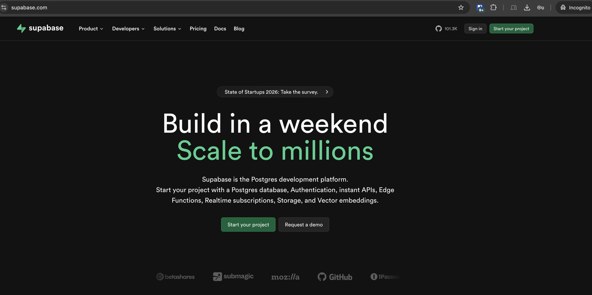
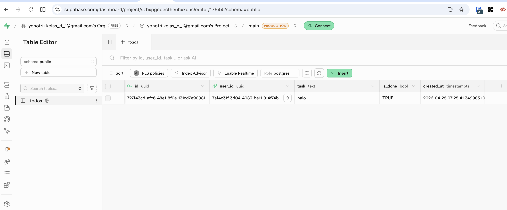
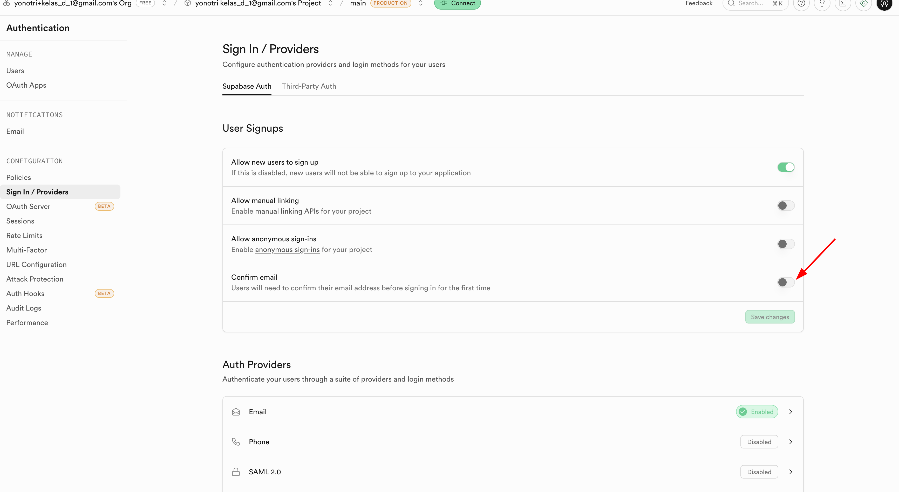
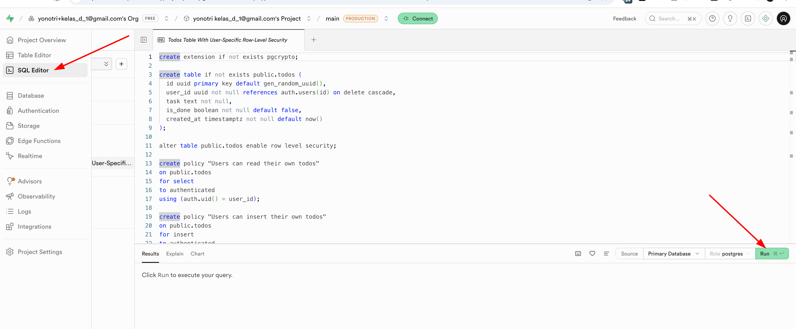
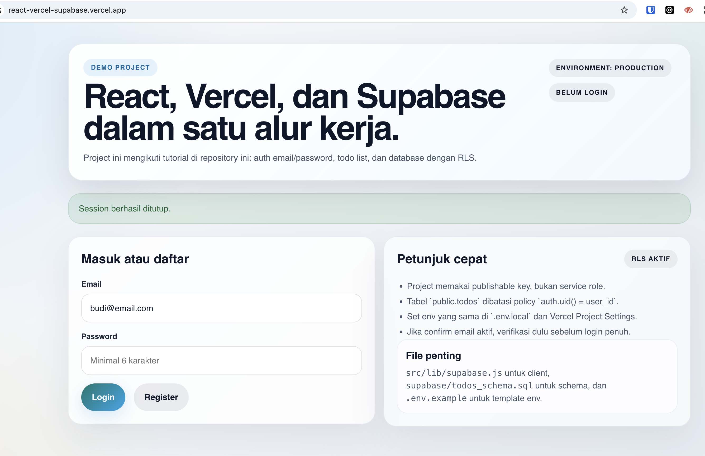
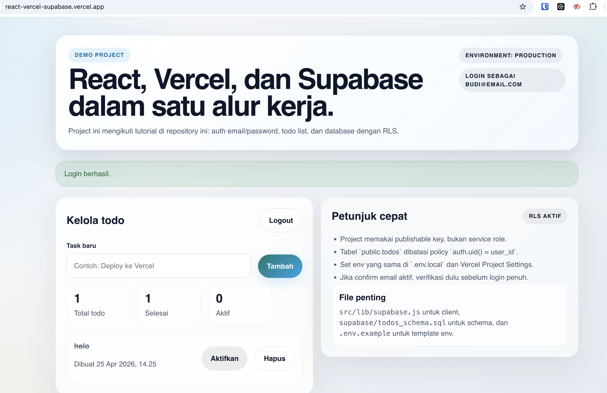
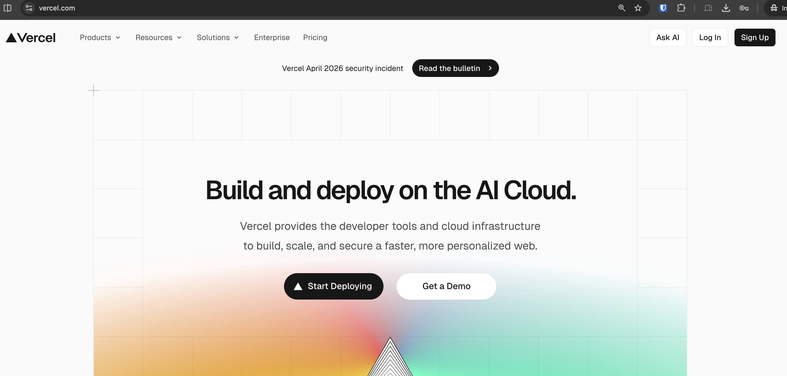
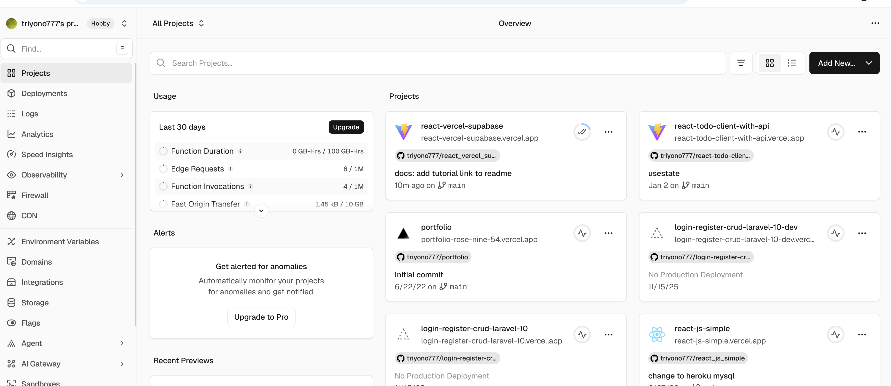

# Tutorial React JS + Vercel + Supabase

Tutorial ini memandu Anda membuat aplikasi React sederhana dengan:

- React + Vite sebagai frontend
- Supabase sebagai database dan authentication
- Vercel sebagai hosting/deployment

Hasil akhir yang akan dibuat:

- User bisa daftar dan login dengan email/password
- User bisa menambah dan melihat todo miliknya sendiri
- Aplikasi bisa dijalankan lokal lalu dideploy ke Vercel

Tutorial ini sekarang juga dilengkapi screenshot referensi dari folder `image_tutorial/` agar langkah setup lebih mudah diikuti.

## 1. Gambaran Arsitektur

Alur aplikasinya sederhana:

1. Frontend React berjalan di browser dan dihosting di Vercel.
2. React memanggil Supabase memakai `@supabase/supabase-js`.
3. User login lewat Supabase Auth.
4. Data todo disimpan di tabel Postgres Supabase.
5. Akses data dibatasi dengan Row Level Security (RLS), jadi tiap user hanya bisa melihat datanya sendiri.

## 2. Bahan Yang Perlu Disiapkan

Siapkan hal berikut:

- Akun [Supabase](https://supabase.com/)
- Akun [Vercel](https://vercel.com/)
- Akun GitHub atau GitLab untuk integrasi deployment
- Node.js versi `20.19+` atau `22.12+`
- `npm`
- `git`

Opsional tapi sangat membantu:

- VS Code
- Vercel CLI

## 3. Struktur Hasil Yang Disarankan

Nanti struktur proyek React Anda kurang lebih seperti ini:

```text
react-vercel-supabase/
├── src/
│   ├── lib/
│   │   └── supabase.js
│   ├── App.jsx
│   ├── main.jsx
│   └── index.css
├── .env.local
├── .gitignore
├── package.json
└── vite.config.js
```

## 4. Buat Project Supabase

1. Masuk ke dashboard Supabase.
2. Klik `New project`.
3. Pilih organization.
4. Isi:
   - `Project name`
   - `Database password`
   - `Region` terdekat dengan mayoritas user Anda
5. Tunggu sampai project aktif.

Setelah project jadi, simpan 2 nilai penting ini dari menu `Connect` atau `Project Settings > API`:

- `Project URL`
- `Publishable key`

Catatan penting:

- Untuk frontend React, gunakan `Publishable key`.
- Jangan pernah menaruh `service_role` atau secret key di aplikasi frontend.

Contoh tampilan halaman awal Supabase:



Setelah data mulai terisi, dashboard Supabase Anda kurang lebih akan terlihat seperti ini:



## 5. Atur Auth Di Supabase

Untuk tutorial ini kita pakai email/password.

Langkah:

1. Buka `Authentication > Providers`.
2. Pastikan provider `Email` aktif.
3. Cek apakah `Confirm email` aktif.

Penjelasan:

- Pada project hosted Supabase, verifikasi email biasanya aktif secara default.
- Jika `Confirm email` aktif, user harus klik email verifikasi sebelum session login penuh tersedia.
- Jika Anda ingin demo lokal lebih cepat, Anda bisa mematikan verifikasi email sementara untuk latihan.

Catatan produksi:

- Untuk produksi, pertimbangkan tetap mengaktifkan verifikasi email.
- Layanan email default Supabase terbatas untuk pengujian. Untuk produksi, siapkan custom SMTP.

Contoh letak pengaturan `Confirm email` di Supabase:



## 6. Buat Tabel Todo + RLS

Buka `SQL Editor` di Supabase lalu jalankan SQL berikut:

```sql
create extension if not exists pgcrypto;

create table if not exists public.todos (
  id uuid primary key default gen_random_uuid(),
  user_id uuid not null references auth.users(id) on delete cascade,
  task text not null,
  is_done boolean not null default false,
  created_at timestamptz not null default now()
);

alter table public.todos enable row level security;

create policy "Users can read their own todos"
on public.todos
for select
to authenticated
using (auth.uid() = user_id);

create policy "Users can insert their own todos"
on public.todos
for insert
to authenticated
with check (auth.uid() = user_id);

create policy "Users can update their own todos"
on public.todos
for update
to authenticated
using (auth.uid() = user_id)
with check (auth.uid() = user_id);

create policy "Users can delete their own todos"
on public.todos
for delete
to authenticated
using (auth.uid() = user_id);
```

Kenapa setup ini penting:

- `RLS` menjaga data tidak otomatis terbuka.
- Policy `auth.uid() = user_id` memastikan tiap user hanya bisa mengakses baris miliknya sendiri.
- Untuk operasi `update`, policy `select` juga penting agar update tidak diam-diam gagal.

Contoh tampilan `SQL Editor` saat menjalankan schema:



## 7. Buat Project React Dengan Vite

Jalankan:

```bash
npm create vite@latest react-vercel-supabase -- --template react
cd react-vercel-supabase
npm install
npm install @supabase/supabase-js
```

Jika Anda ingin membuat project langsung di folder aktif:

```bash
npm create vite@latest . -- --template react
npm install
npm install @supabase/supabase-js
```

## 8. Tambahkan File Environment

Buat file `.env.local`:

```env
VITE_SUPABASE_URL=https://YOUR_PROJECT_ID.supabase.co
VITE_SUPABASE_PUBLISHABLE_KEY=YOUR_SUPABASE_PUBLISHABLE_KEY
```

Catatan:

- Di Vite, environment variable untuk frontend harus diawali `VITE_`.
- Simpan `.env.local` di root project React.
- Jangan commit file yang berisi secret atau kredensial sensitif.

Contoh `.gitignore` minimal:

```gitignore
node_modules
dist
.env.local
.vercel
```

## 9. Buat Client Supabase

Buat file `src/lib/supabase.js`:

```js
import { createClient } from '@supabase/supabase-js'

export const supabase = createClient(
  import.meta.env.VITE_SUPABASE_URL,
  import.meta.env.VITE_SUPABASE_PUBLISHABLE_KEY
)
```

## 10. Buat Halaman React Sederhana

Ganti isi `src/App.jsx` dengan contoh berikut:

```jsx
import { useEffect, useState } from 'react'
import { supabase } from './lib/supabase'

export default function App() {
  const [session, setSession] = useState(null)
  const [todos, setTodos] = useState([])
  const [email, setEmail] = useState('')
  const [password, setPassword] = useState('')
  const [task, setTask] = useState('')
  const [message, setMessage] = useState('')
  const [loading, setLoading] = useState(false)

  useEffect(() => {
    supabase.auth.getSession().then(({ data }) => {
      setSession(data.session)
    })

    const {
      data: { subscription },
    } = supabase.auth.onAuthStateChange((_event, nextSession) => {
      setSession(nextSession)
      if (!nextSession) {
        setTodos([])
      }
    })

    return () => subscription.unsubscribe()
  }, [])

  useEffect(() => {
    if (session?.user) {
      fetchTodos()
    }
  }, [session])

  async function fetchTodos() {
    const { data, error } = await supabase
      .from('todos')
      .select('id, task, is_done, created_at')
      .order('created_at', { ascending: false })

    if (error) {
      setMessage(error.message)
      return
    }

    setTodos(data ?? [])
  }

  async function handleSignUp(event) {
    event.preventDefault()
    setLoading(true)
    setMessage('')

    const { error } = await supabase.auth.signUp({
      email,
      password,
    })

    if (error) {
      setMessage(error.message)
    } else {
      setMessage('Registrasi berhasil. Cek email verifikasi jika confirm email aktif.')
    }

    setLoading(false)
  }

  async function handleSignIn(event) {
    event.preventDefault()
    setLoading(true)
    setMessage('')

    const { error } = await supabase.auth.signInWithPassword({
      email,
      password,
    })

    if (error) {
      setMessage(error.message)
    } else {
      setMessage('Login berhasil.')
    }

    setLoading(false)
  }

  async function handleSignOut() {
    const { error } = await supabase.auth.signOut()
    if (error) {
      setMessage(error.message)
    }
  }

  async function handleAddTodo(event) {
    event.preventDefault()

    if (!task.trim() || !session?.user) {
      return
    }

    const { error } = await supabase.from('todos').insert({
      user_id: session.user.id,
      task: task.trim(),
    })

    if (error) {
      setMessage(error.message)
      return
    }

    setTask('')
    fetchTodos()
  }

  async function handleToggleTodo(todo) {
    const { error } = await supabase
      .from('todos')
      .update({ is_done: !todo.is_done })
      .eq('id', todo.id)

    if (error) {
      setMessage(error.message)
      return
    }

    fetchTodos()
  }

  return (
    <main style={{ maxWidth: 720, margin: '40px auto', fontFamily: 'sans-serif' }}>
      <h1>React + Supabase + Vercel</h1>
      <p>Demo todo app dengan auth dan database Supabase.</p>

      {message && <p>{message}</p>}

      {!session ? (
        <form onSubmit={handleSignIn} style={{ display: 'grid', gap: 12 }}>
          <input
            type="email"
            placeholder="Email"
            value={email}
            onChange={(event) => setEmail(event.target.value)}
          />
          <input
            type="password"
            placeholder="Password"
            value={password}
            onChange={(event) => setPassword(event.target.value)}
          />

          <div style={{ display: 'flex', gap: 12 }}>
            <button type="submit" disabled={loading}>
              Login
            </button>
            <button type="button" onClick={handleSignUp} disabled={loading}>
              Register
            </button>
          </div>
        </form>
      ) : (
        <>
          <div style={{ display: 'flex', justifyContent: 'space-between', alignItems: 'center' }}>
            <p>Login sebagai: {session.user.email}</p>
            <button onClick={handleSignOut}>Logout</button>
          </div>

          <form onSubmit={handleAddTodo} style={{ display: 'flex', gap: 12, marginBottom: 24 }}>
            <input
              type="text"
              placeholder="Tambah todo"
              value={task}
              onChange={(event) => setTask(event.target.value)}
              style={{ flex: 1 }}
            />
            <button type="submit">Tambah</button>
          </form>

          <ul style={{ padding: 0, listStyle: 'none', display: 'grid', gap: 12 }}>
            {todos.map((todo) => (
              <li
                key={todo.id}
                style={{
                  display: 'flex',
                  justifyContent: 'space-between',
                  alignItems: 'center',
                  padding: 12,
                  border: '1px solid #ddd',
                  borderRadius: 12,
                }}
              >
                <span style={{ textDecoration: todo.is_done ? 'line-through' : 'none' }}>
                  {todo.task}
                </span>
                <button onClick={() => handleToggleTodo(todo)}>
                  {todo.is_done ? 'Batalkan' : 'Selesai'}
                </button>
              </li>
            ))}
          </ul>
        </>
      )}
    </main>
  )
}
```

Catatan kecil:

- Tombol `Register` memakai `type="button"` supaya tidak ikut submit ke login handler.
- Fungsi `signUp` bisa berhasil tetapi session belum aktif kalau verifikasi email diwajibkan.

Tampilan halaman login pada project contoh:



## 11. Jalankan Lokal

Jalankan:

```bash
npm run dev
```

Lalu buka:

```text
http://localhost:5173
```

jika error , jalankan
```
rm -rf node_modules/.vite
```
dan install lagi
```
npm install
```


Checklist pengujian lokal:

1. Register user baru.
2. Jika verifikasi email aktif, buka email lalu verifikasi.
3. Login.
4. Tambahkan todo.
5. Refresh browser dan cek data tetap ada.
6. Login dengan akun lain dan pastikan todo user pertama tidak terlihat.

Jika semua langkah benar, halaman utama aplikasi kurang lebih terlihat seperti ini:



## 12. Push Ke Git Repository

Contoh alur dasar:

```bash
git init
git add .
git commit -m "feat: initial react supabase app"
git branch -M main
git remote add origin https://github.com/USERNAME/NAMA-REPO.git
git push -u origin main
```

Kalau repository sudah ada, cukup:

```bash
git add .
git commit -m "feat: connect react app to supabase"
git push
```

## 13. Deploy Ke Vercel

Ada 2 cara umum: lewat dashboard atau CLI. Untuk pemula, dashboard biasanya paling cepat.

### Opsi A: Deploy lewat dashboard Vercel

1. Masuk ke Vercel.
2. Klik `Add New > Project`.
3. Import repository GitHub/GitLab Anda.
4. Vercel biasanya otomatis mengenali project Vite.
5. Jika perlu, pastikan setting build:
   - `Build Command`: `npm run build`
   - `Output Directory`: `dist`
6. Tambahkan environment variable:
   - `VITE_SUPABASE_URL`
   - `VITE_SUPABASE_PUBLISHABLE_KEY`
7. Tambahkan variabel minimal untuk environment:
   - `Production`
   - `Preview`
8. Klik `Deploy`.

Contoh halaman awal Vercel sebelum import project:



Contoh dashboard project di Vercel setelah aplikasi berhasil terhubung:



### Opsi B: Deploy lewat Vercel CLI

```bash
npm install -g vercel
vercel
```

Ikuti prompt sampai project terhubung.

Untuk production deploy:

```bash
vercel --prod
```

## 14. Sinkronkan Environment Variable Ke Vercel

Nilai yang harus sama antara lokal dan Vercel:

```env
VITE_SUPABASE_URL=...
VITE_SUPABASE_PUBLISHABLE_KEY=...
```

Catatan penting:

- Di Vercel, perubahan environment variable tidak otomatis mengubah deployment lama.
- Setelah mengubah environment variable, lakukan redeploy.
- Untuk project Vite, variable frontend harus tetap diawali `VITE_`.

Jika ingin menarik environment variable development dari Vercel ke lokal:

```bash
vercel env pull
```

## 15. Verifikasi Setelah Deploy

Setelah URL Vercel aktif, uji hal berikut:

1. Halaman bisa terbuka tanpa blank page.
2. Register/login berjalan.
3. Todo bisa ditambah.
4. Todo user A tidak terlihat oleh user B.
5. Refresh browser tidak merusak session.

## 16. Masalah Yang Sering Muncul

### Error `Invalid API key`

Penyebab umum:

- Salah copy key
- Memakai secret key atau `service_role` di frontend

Solusi:

- Pakai `Publishable key`
- Cek ulang `VITE_SUPABASE_PUBLISHABLE_KEY`

### Data tidak muncul setelah login

Penyebab umum:

- RLS aktif tapi policy belum benar
- Baris `user_id` tidak diisi saat insert

Solusi:

- Pastikan policy memakai `auth.uid() = user_id`
- Pastikan insert mengirim `user_id: session.user.id`

### Register berhasil tapi tidak bisa langsung login

Penyebab umum:

- `Confirm email` aktif

Solusi:

- Verifikasi email user dulu
- Atau matikan confirm email sementara untuk latihan

### Build Vercel sukses tapi aplikasi gagal akses env

Penyebab umum:

- Nama variable tidak diawali `VITE_`
- Variable belum ditambahkan ke environment yang benar

Solusi:

- Gunakan `VITE_SUPABASE_URL`
- Gunakan `VITE_SUPABASE_PUBLISHABLE_KEY`
- Tambahkan untuk `Production` dan `Preview`, lalu redeploy

## 17. Pengembangan Lanjutan

Setelah tutorial dasar ini selesai, Anda bisa lanjut ke:

- Supabase Storage untuk upload file/gambar
- Realtime untuk update data live
- Role-based access dengan policy yang lebih rinci
- Password reset
- Social login
- Edge Functions untuk logika backend tertentu

## 18. Ringkasan Praktis

Kalau diringkas, alur kerjanya adalah:

1. Buat project Supabase.
2. Ambil `Project URL` dan `Publishable key`.
3. Buat tabel dan policy RLS.
4. Buat app React dengan Vite.
5. Install `@supabase/supabase-js`.
6. Simpan env di `.env.local`.
7. Buat client Supabase dan integrasikan ke React.
8. Push ke Git.
9. Deploy ke Vercel.
10. Set env yang sama di Vercel lalu redeploy.

## 19. Referensi Resmi

Referensi yang dipakai untuk memastikan langkah setup tetap relevan:

- Supabase React quickstart:
  [https://supabase.com/docs/guides/getting-started/quickstarts/reactjs](https://supabase.com/docs/guides/getting-started/quickstarts/reactjs)
- Supabase React auth quickstart:
  [https://supabase.com/docs/guides/auth/quickstarts/react](https://supabase.com/docs/guides/auth/quickstarts/react)
- Supabase password auth:
  [https://supabase.com/docs/guides/auth/passwords](https://supabase.com/docs/guides/auth/passwords)
- Supabase user management:
  [https://supabase.com/docs/guides/auth/managing-user-data](https://supabase.com/docs/guides/auth/managing-user-data)
- Vercel environment variables:
  [https://vercel.com/docs/environment-variables](https://vercel.com/docs/environment-variables)
- Vercel for Vite:
  [https://vercel.com/docs/frameworks/frontend/vite](https://vercel.com/docs/frameworks/frontend/vite)
- Vite getting started:
  [https://vite.dev/guide/](https://vite.dev/guide/)
